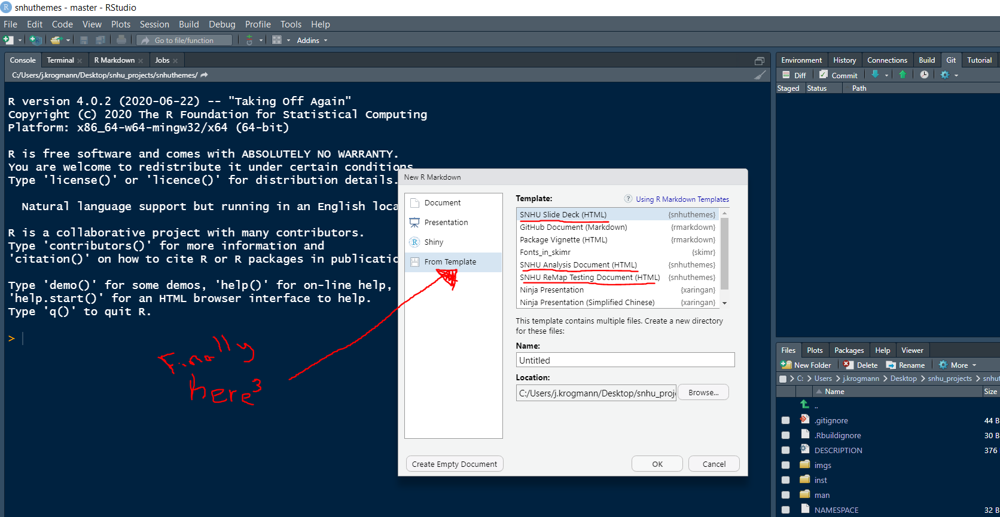
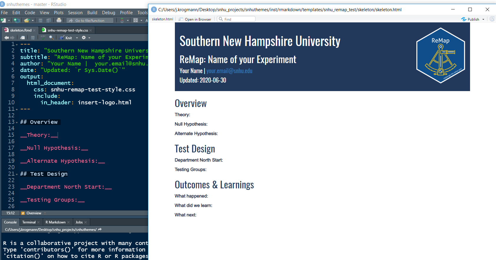
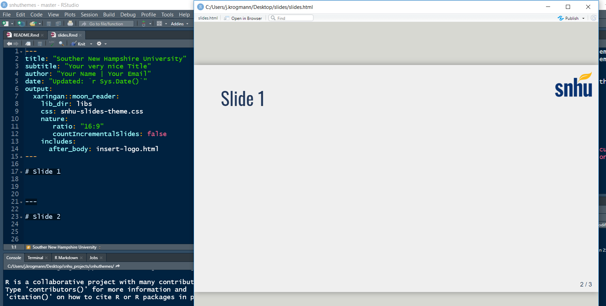

# snhuthemes 

Southern New Hampshire University brand approved templates

## Installation

```r
if (!requireNamespace("devtools")) install.packages("devtools")
devtools::install_github("Jordan-Krogmann/snhuthemes")
```

## Templates

The `rmarkdown` templates have a css file that they sit on top of to make them on brand. The templates follow common analysis trope, so anything from an Analysis with a recommendation to a framework for A/B  testing.

1. Go New File
2. Select create new __R markdown...__
3. Select __From Template__
    



### SNHU Analysis Document (HTML)

1. Go to create new R markdown
    + select __From Template__
    + then select __SNHU Analysis Document (HTML)__
2. Fill with meaningful analysis and the render

  

<br>

### SNHU ReMap Testing Document (HTML)

1. Go to create new R markdown
    + select __From Template__
    + then select __SNHU ReMap Testing Document (HTML)__
2. Fill with meaningful analysis and the render


  

<br>

### SNHU Slide Deck (HTML)

1. Go to create new R markdown
    + select __From Template__
    + then select __SNHU Slide Deck (HTML)__
2. Fill with meaningful analysis and the render

  

<br>
<br>

## Plot Theme

default `ggplot2` theme

``` r
ggplot(data = mtcars, aes(x = wt, y = mpg)) +
    geom_point(aes(color = as.factor(cyl))) +
    facet_grid(~ cyl) + 
    labs(
      title = "An Amazing Plot",
      subtitle = "What can the subtitle tell us?"
    ) 
```


Adding `theme_snhu()` to existing `ggplot` code.

``` r
ggplot(data = mtcars, aes(x = wt, y = mpg)) +
    geom_point(aes(color = as.factor(cyl))) +
    facet_grid(~ cyl) + 
    labs(
      title = "An Amazing Plot",
      subtitle = "What can the subtitle tell us?"
    ) + 
    theme_snhu()
```


