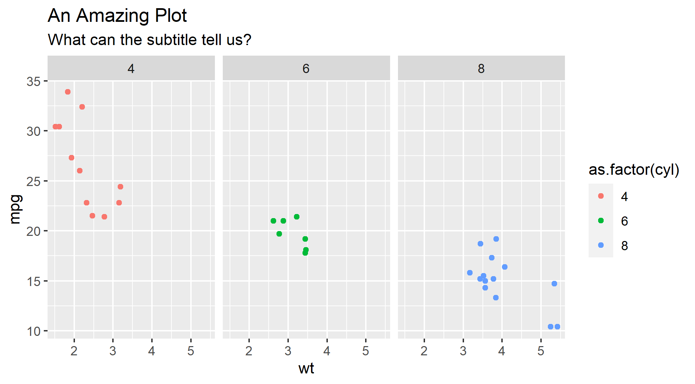
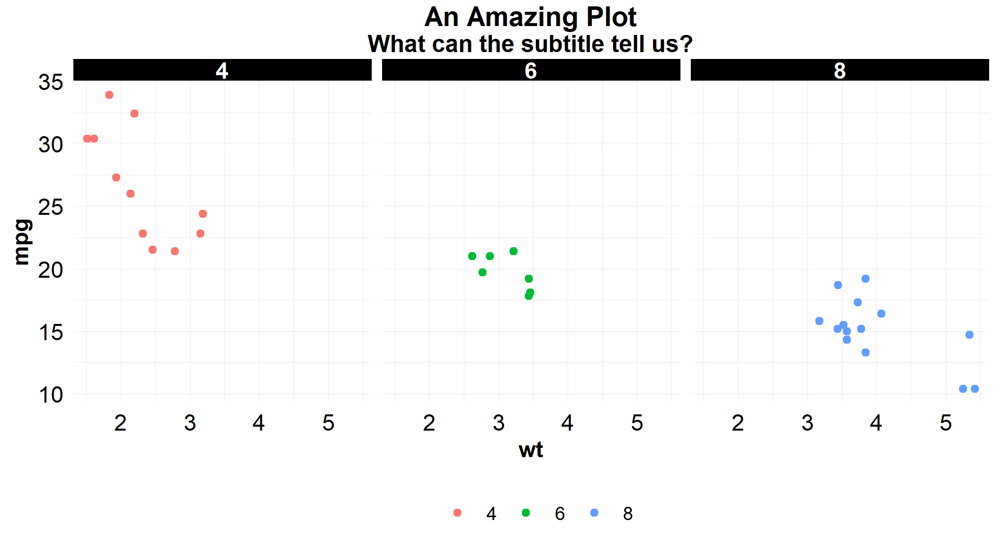

# snhuthemes 

Southern New Hampshire University brand approved templates

## Installation

```r
if (!requireNamespace("devtools")) install.packages("devtools")
devtools::install_github("Jordan-Krogmann/snhuthemes")
```

## Templates

+ SNHU Analysis Document (HTML)


## Plot Theme

default `ggplot2` theme

``` r
ggplot(data = mtcars, aes(x = wt, y = mpg)) +
    geom_point(aes(color = as.factor(cyl))) +
    facet_grid(~ cyl) + 
    labs(
      title = "An Amazing Plot",
      subtitle = "What can the subtitle tell us?"
    ) 
```




Adding `theme_snhu()` to existing `ggplot` code.

``` r
ggplot(data = mtcars, aes(x = wt, y = mpg)) +
    geom_point(aes(color = as.factor(cyl))) +
    facet_grid(~ cyl) + 
    labs(
      title = "An Amazing Plot",
      subtitle = "What can the subtitle tell us?"
    ) + 
    theme_snhu()
```



