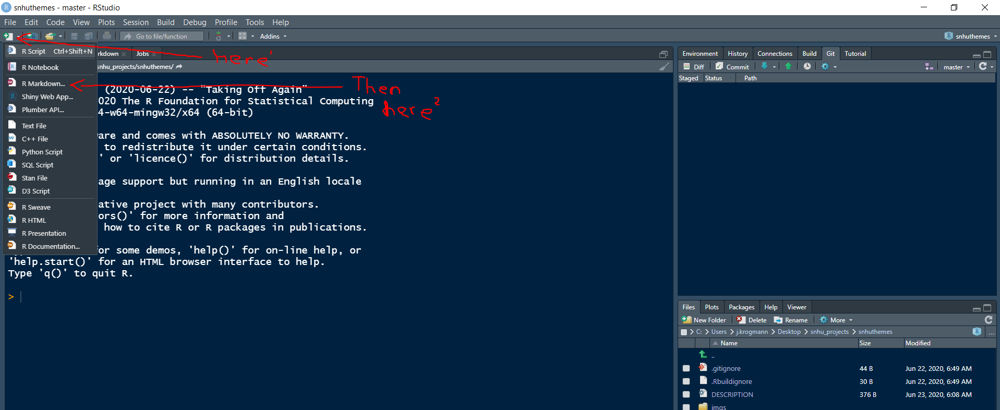
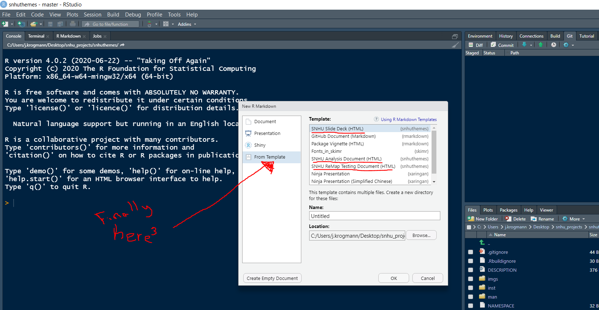
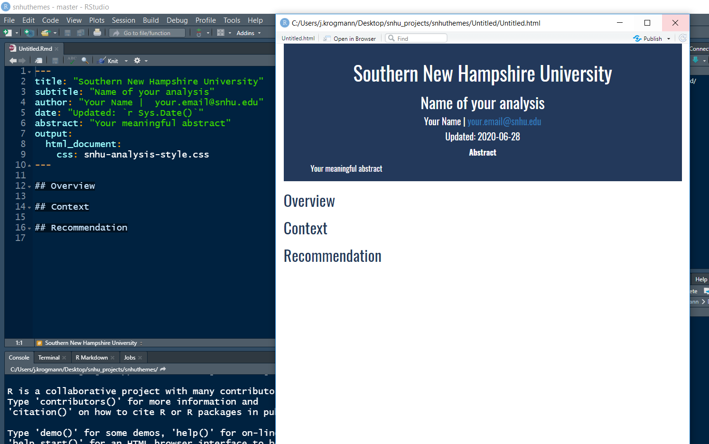
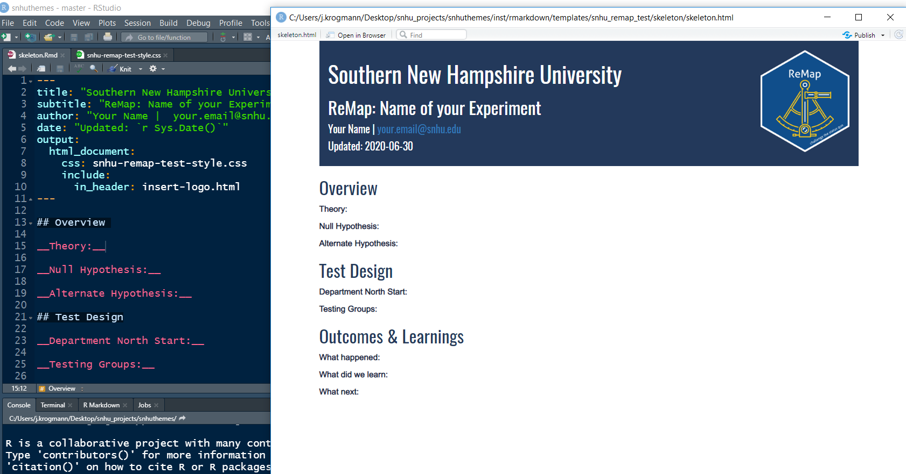
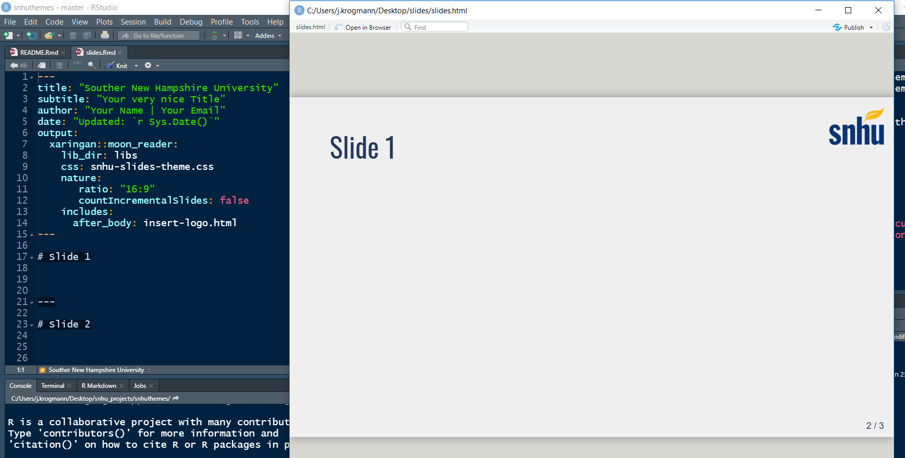

# snhuthemes 

Southern New Hampshire University brand approved templates

## Installation

``` r
if (!requireNamespace("devtools")) install.packages("devtools")
devtools::install_github("Jordan-Krogmann/snhuthemes")
```

## Templates

The `rmarkdown` templates have a css file that they sit on top of to
make them on brand. The templates follow common analysis trope, so
anything from an Analysis with a recommendation to a framework for A/B
testing. Keep in mind that these are templates are suggestions on how to
structure analysis not law.

1.  Go New File

2.  Select create new **R markdown…**

3.  Select **From Template**
    
    |       Find Template        |      Template Options      |
    | :------------------------: | :------------------------: |
    |  |  |
    

### SNHU Analysis Document (HTML)

The **SNHU Analysis Document** is meant to structure an analysis around
a question. The business often has a question that we have to address.

  - **Overview** meant to provide facts about the question.
  - **Context** meant to answer why it is like that.
  - **Recommendation**, if needed, is meant to serve as next steps.



<br>

### SNHU ReMap Testing Document (HTML)

**ReMap** is responsible for a lot of experiments. The **SNHU ReMap
Testing Document** is meant to serve a stricter guide on constructing a
successful experiment.

  - The **Overview** section should be filled before you run the
    experiment and has the **Idea/Theory** and the structure
    **Hypothesis** for the test.  
  - The **Test Design** section should also be fill out before you run
    your experiment, it should also have what metric you are trying to
    influence and how you are going to set up the test (e.g. who will be
    in the control, how long…).  
  - Lastly, the **Outcomes & Learnings** section is the result of the
    test and what the next steps are (e.g. expand, refine, or kill).



<br>

### SNHU Slide Deck (HTML)

It’s a slide deck… not a real document, but go nuts.



<br> <br>

## Plot Theme

default `ggplot2` theme

``` r
ggplot(data = mtcars, aes(x = wt, y = mpg)) +
    geom_point(aes(color = as.factor(cyl))) +
    facet_grid(~ cyl) + 
    labs(
      title = "An Amazing Plot",
      subtitle = "What can the subtitle tell us?"
    ) 
```


Adding `theme_snhu()` to existing `ggplot` code.

``` r
ggplot(data = mtcars, aes(x = wt, y = mpg)) +
    geom_point(aes(color = as.factor(cyl))) +
    facet_grid(~ cyl) + 
    labs(
      title = "An Amazing Plot",
      subtitle = "What can the subtitle tell us?"
    ) + 
    theme_snhu()
```


